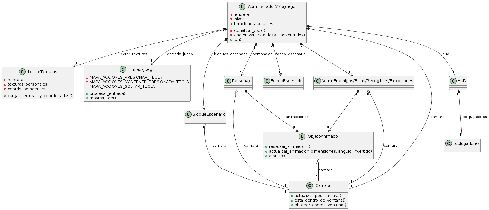
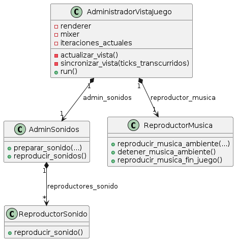
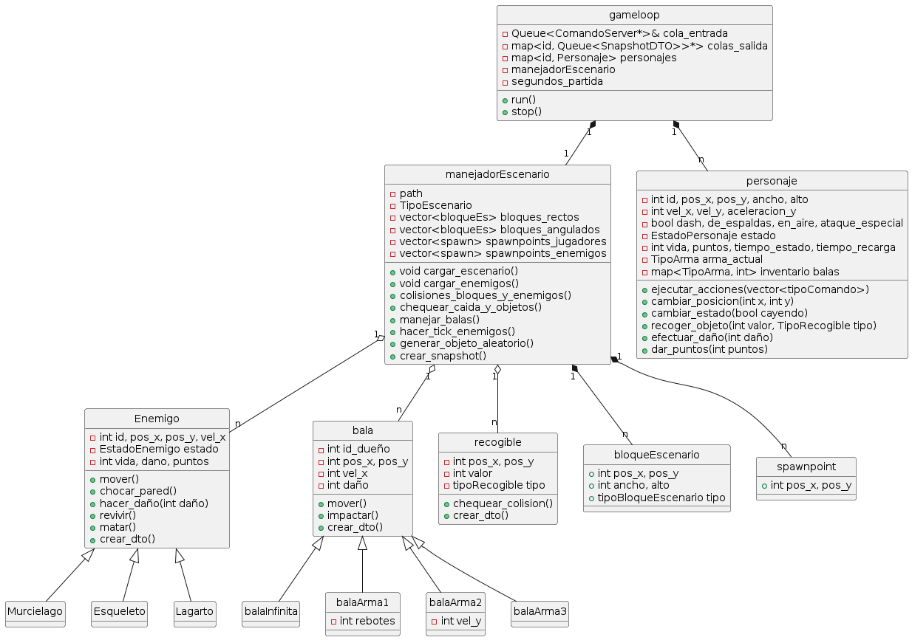

# Documentación técnica

A grandes rasgos, se puede ver que la solución está compuesta por 3 elementos. La interfaz de usuario, el protocolo y la
lógica del juego. A continuación iremos describiendo cómo está conformada cada una de ellas.

## Vista dentro del juego

Toda la vista dentro del juego (es decir, lo que el usuario puede ver dentro de una partida) se encuentra implementada
utilizando la librería gráfica `SDL2`, mediante otra librería wrapper llamada `SDL2pp`. Esta última brinda gran parte de
las funcionalidades disponibles de `SDL2` siguiendo el paradigma de programación orientada a objetos y patrones de
diseño
RAII.

Para el desarrollo del proyecto fue necesario diseñar e implementar algunas clases que representen las entidades o
elementos presentes en el juego, con el fin de disponer de una interfaz modularizada para mostrar y actualizar su vista.
El código de estas clases se encuentra disponible en la carpeta `/src/client/vista_juego`.

A continuación, se muestra un diagrama de clases de la vista del juego, más específicamente de la parte visual
_(el diagrama es simplificado, se omiten algunos atributos y métodos)_:

### AdministradorVistaJuego

Esta es la clase principal de la vista dentro del juego, responsable de administrar y actualizar todos los objetos
visuales en el lado del cliente (con ayuda de clases auxiliares). Es instanciada una única vez, al momento de comenzar
una partida. Su método `run` es el bucle principal de la vista. Allí, mediante el uso de métodos auxiliares, se realizan
los siguientes pasos:

1. **Procesar la entrada de usuario**: Realizado mediante la clase `EntradaJuego` (explicada más adelante).

2. **Actualizar la vista**: Con el método `actualizar_vista`, se obtienen todas las snapshots de juego pendientes en la
   clase `Cliente`, para luego procesar la última de estas (salvo que se trate de la primera snapshot, única que
   contiene
   la información de los bloques del escenario, o la última, la cual indica el fin del juego). Luego, llama a métodos
   auxiliares para actualizar el estado visual de los jugadores, bloques de escenario, fondo del escenario, enemigos,
   balas, objetos recogibles, efectos de explosión, cámara y HUD (Head-Up Display). Adicionalmente, indica si se debe
   producir algún efecto de sonido.

3. **Dibujar objetos y reproducir efectos de sonido**: Se dibujan todos los elementos del juego y se reproducen todos
   los efectos de sonido pendientes de acuerdo a la actualización del paso anterior.

4. **Sincronizar vista**: Gracias al método `sincronizar_vista`, la vista del juego se sincroniza con el tiempo
   transcurrido del juego, de forma de mantener una tasa de 30 fotogramas por segundo. Permite saltear fotogramas en
   caso
   de sufrir un retraso en la renderización, siguiendo una política _drop & rest_.

En cada ejecución de este ciclo, se incrementa el atributo privado `iteraciones_actuales`, el cual es utilizado para
sincronizar todas las animaciones. _(Nota: este incremento puede ser mayor a 1 por ciclo si se tuvieron que droppear
frames de renderizado)._

### LectorTexturas

Clase fundamental del juego, encargada de leer y procesar las texturas de la vista y las coordenadas de cada uno de los
sprites de animación de todos los elementos visuales. Para esto lee las imágenes disponibles dentro de la carpeta
`assets/sprites`, junto con archivos de configuración YAML que determinan tales coordenadas.

Los archivos YAML cuentan con múltiples entradas, indicando los valores numéricos de las coordenadas x, y, ancho y alto
de cada uno de los sprites de las animaciones en las imágenes correspondientes. Trabajar con este formato tiene la
ventaja de poder realizar pequeños ajustes a los sprites a la hora de testear su visualización sin tener que editar las
imágenes.

Esta clase es instanciada una única vez por el `AdministradorVistaJuego` (como un atributo privado). Otras clases
auxiliares que requieren su uso reciben en su constructor una referencia a esta instancia. El `LectorTexturas` carga
todos los datos una sola vez al llamar a su método `cargar_texturas_y_coordenadas` desde el constructor de tal clase.
Cuenta con métodos de tipo getters que permiten obtener cualquier textura o coordenadas de sprite según el nombre con el
que fueron guardados en los archivos YAML.

Todas las coordenadas de sprites se almacenan y se utilizan en el juego en instancias de la clase `Rect` de `SDL2pp`.

### EntradaJuego

Clase responsable de leer la entrada del jugador por teclado y enviárselo a la clase `Cliente`. Tiene definidos un par
de diccionarios constantes que determina el mapeo entre teclas y acciones del juego. La clase realiza una distinción
entre el procesamiento de teclas que pueden mantenerse apretadas (como la tecla de correr, por ejemplo) y aquellas que
no (como la tecla de saltar), con el objetivo de enviar las acciones realizadas correctamente.

### ObjetoAnimado

La clase `ObjetoAnimado` modela un objeto visual genérico dentro del juego. Más específicamente, representa una de sus
animaciones. Esto se ve ejemplificado en la clase `Personaje`, la cual se relaciona por composición con `ObjetoAnimado`,
teniendo una instancia de esta clase por cada animación posible del jugador (correr, quedarse quieto, saltar, etc.). Se
utiliza también en elementos del juego que no cuentan con una animación, solo con un sprite estático (los objetos
recogibles, por ejemplo).

Cuenta con métodos para poder actualizar la posición del objeto a renderizar, teniendo en cuenta la posición relativa
del objeto respecto al jugador del cliente y las dimensiones de su sprite. Recibe el valor de `iteraciones_actuales` en
cada actualización, y en base a este determina el sprite actual de la animación. Si el objeto cuenta con un único
sprite, siempre muestra el mismo.

### Personaje

Representa un personaje jugable dentro del juego. Tal como fue mencionado antes, se compone de múltiples instancias de
`ObjetoAnimado`, una por cada animación:

* Stand (quedarse quieto)
* Correr
* Dash
* Disparar
* Saltar hacia arriba
* Caer hacia abajo
* Saltar hacia un costado
* Caer hacia un costado
* Ataque especial
* Intoxicado quieto
* Intoxicado caminando
* Herido
* Muerte

A la hora de actualizar su animación, la clase selecciona al ObjetoAnimado asociado a la nueva animación actual en
función del nuevo estado recibido y resetea la animación anterior.

La clase cuenta con métodos privados y diccionarios constantes que determinan, para cada una de las animaciones, cómo
debe ser corregido el desfase entre las dimensiones del sprite y las dimensiones reales del personaje en la lógica de
juego, además de si se debe repetir la animación una vez finalizada o no.

### BloqueEscenario

Modela un bloque fijo del escenario. Debido a que no tiene actualizaciones de animación, su implementación es más
sencilla que la de `ObjetoAnimado`. Posee la particularidad de dibujarse repitiendo una misma textura a lo largo de toda
el área recibida por parámetro en el constructor. Gracias a esto, el servidor tiene la posibilidad de unir varios
bloques cuadrados contiguos en un mismo bloque rectangular dentro de la lógica de juego, y aún así visualmente se
observa como varios bloques separados.

### FondoEscenario

Representa el fondo que se puede observar detrás de todos los elementos del juego. Se trata de una clase sencilla, pues
el fondo es una imagen estática que no recibe actualizaciones. Se instancia una única vez como atributo privado de
`AdministradorVistaJuego`, siendo esta la única clase que lo utiliza.

### AdminEnemigos

Clase encargada de administrar la vista de todos los enemigos del juego. Agrega, actualiza y elimina los enemigos cuando
sea necesario. Es instanciada una única vez como atributo privado de `AdministradorVistaJuego`.

Siendo que los enemigos poseen una única animación, cada uno de ellos es representado dentro del juego con una instancia
de `ObjetoAnimado`. Con el fin de evitar que el `AdministradorVistaJuego` maneje estos objetos directamente, la clase
`AdminEnemigos` se responsabiliza de su gestión. Esta clase cuenta con métodos para actualizar y dibujar cada uno de los
enemigos, según sus coordenadas, su tamaño y su distancia respecto del jugador del cliente, teniendo en cuenta todo esto
el desfase entre tamaño del sprite y dimensiones reales del enemigo.

La clase tiene una política particular para decidir cuándo debe ser eliminado un enemigo de la vista: cuando transcurrió
una cantidad de iteraciones determinada (definida como constante, por defecto 3) sin recibir a ese enemigo en una
snapshot de juego, se remueve. Esto permite poder saltear algunos frames de animación sin provocar que los enemigos
dejen de verse momentáneamente.

### AdminBalas, AdminRecogibles

Clases similares entre sí, se encargan de gestionar la vista de los proyectiles de las cuatro armas y los objetos
recogibles (gemas, monedas, municiones, bebidas envenenadas y zanahorias) respectivamente. Ambos tipos de elementos
visuales se representan con un `ObjetoAnimado` por cada uno de ellos, a pesar de que no posean animaciones. Debido a que
no es necesario su actualización de animación, estas dos clases agregan todos los objetos recibidos, los dibujan y los
eliminan a todos en cada iteración.

Cada una de estas clases es instanciada una única vez en `AdministradorVistaJuego`, siendo atributos privados de tal
clase.

### AdminExplosiones

Esta clase es la encargada de actualizar todos los efectos de explosión producidos durante la partida. Tales efectos se
producen cuando un proyectil del `ARMA2` impacta contra una superficie o entidad. Cuando el `AdministradorVistaJuego`
detecta que se produjo este evento, llama a un método de `AdminExplosiones` para agregar una explosión, la cual se
actualizará y dibujará en cada iteración para posteriormente ser eliminada al haber completado la animación.

Es instanciada una única vez como atributo privado de `AdministradorVistaJuego`.

### Camara

La `Camara` es una clase fundamental de la vista del juego: es responsable de determinar si un objeto visual debe ser
renderizado o no, de acuerdo a si entra en la ventana actualmente. Además, la clase realiza la conversión entre
coordenadas absolutas asociadas a la lógica de juego y coordenadas de ventana, de acuerdo con la posición del personaje
asociado al cliente. Tales funcionalidades son cruciales ya que cualquier mapa lo suficientemente grande como para ser
jugable posee un tamaño superior a las dimensiones de la ventana, lo cual conlleva que solo un subconjunto de todos los
elementos visuales debe ser dibujado en cada instante.

La secuencia de trabajo de la Camara es la siguiente:

1. Se crea una única instancia de la clase en `AdministradorVistaJuego`, y todos los objetos visuales se construyen
   recibiendo por parámetro una referencia a esta instancia.
2. En cada iteración del ciclo principal, dentro del método `actualizar_vista` de `AdministradorVistaJuego` se busca
   primero el personaje asociado al cliente entre todos los recibidos en la snapshot, para poder actualizar la posición
   de
   la `Camara` en ese instante.
3. Se actualiza el estado/animación de todos los objetos visuales, los cuales internamente llaman al método
   `obtener_coords_ventana` de la `Camara` para realizar la conversión de coordenadas antes mencionada.
4. Dentro de los métodos para dibujar cada uno de estos objetos visuales, se llama al método `esta_dentro_de_ventana` de
   la `Camara`, el cual comprueba si hay al menos una esquina del sprite que entre en la ventana (*). Solo en caso de
   cumplirse esto el objeto visual se renderiza efectivamente.

_(*) Cabe mencionar que se considera un pequeño margen vertical y horizontal extra por fuera de la ventana para realizar
esta comprobación. El tamaño de este margen se encuentra definido en la constante `MARGEN_RENDERIZADO` (por defecto 50
píxeles). De esta forma, se evita dejar de renderizar objetos visuales muy cercanos al borde de la ventana._

Gracias a esta clase se consigue un buen rendimiento del juego, ya que no se consume tiempo ni recursos en renderizar
elementos que no entran en la pantalla.

### HUD

La clase `HUD` (Head-Up Display) es la responsable de mostrar la información del personaje y de la partida dentro del
juego: los puntos, la vida, el número de jugador, el arma actual, sus municiones restantes, el tiempo restante de
partida y el top de mejores jugadores. Además se encarga de mostrar la pantalla de carga y la pantalla de fin de juego.
La información no se muestra con una fuente tipográfica en sí, sino que los números, letras y símbolos son simplemente
imágenes, cargadas de la misma forma que el resto de sprites.

La clase es instanciada una única vez en `AdministradorVistaJuego` como un atributo privado.

### TopJugadores

Clase auxiliar del `HUD`, permite obtener un vector con los datos de los jugadores, ordenado de forma descendente
según la cantidad de puntos. Esto se realiza ordenando todos los jugadores de mayor a menor (cuando se desea obtener
todos los jugadores), o mediante un algoritmo _Top-K_ (cuando se desea obtener únicamente el top 3).

### Sonido dentro del juego

La vista del juego también cuenta con algunas clases encargadas de los sonidos y la música, tal como se puede apreciar
en el siguiente diagrama de clases simplificado:

### ReproductorMusica

Esta clase se encarga de cargar y reproducir la música ambiente y la música de fin de juego. Reproduce una música
ambiente distinta según el tipo de escenario especificado.

### ReproductorSonido

Clase que modela un efecto de sonido del juego. Permite cargarlo y reproducirlo.

### AdminSonidos

Clase responsable de administrar los efectos de sonido dentro del juego. Trabaja en composición con varias instancias
de `ReproductorSonido`, una por cada efecto de sonido distinto dentro del juego.

Los efectos de sonido se establecen como listos para ser reproducidos mediante el método preparar_sonido, el cual es
llamado desde el método `actualizar_vista` de `AdministradorVistaJuego`. Internamente se verifica que no se haya
producido un efecto de sonido del mismo tipo en las últimas iteraciones anteriores (la cantidad está definida como la
constante `ITERACIONES_ENTRE_SONIDOS`, por defecto 10). Esto se realiza para evitar reproducir sonidos demasiado juntos,
lo cual podría resultar molesto. Finalmente, se reproducen los efectos de sonido con el método `reproducir_sonidos`.

## PROTOCOLO

Esta parte es la que conecta la interfaz de usuario con la lógica del servidor. Comenzaremos analizando el
funcionamiento del mismo del lado del cliente y luego pasaremos al lado del servidor.

### CLIENTE

Algo a entender previo a adentrarnos en cada una de las clases es que el cliente está dividido en dos partes, el lobby y
el juego. Cada una de ellas envía y recibe diferentes tipos de comandos así que para cada una de ellas decidimos crear
una clase distinta a través de la cúal se comunicará cada una de las vistas con el servidor.

#### LOBBY

En este paquete encontrarán todos las clases correspondientes a la comunicación del Lobby con el servidor.

##### LOBBY

Esta clase corresponde a la “interfaz de comunicación” del lobby con el servidor. La misma es utilizada por la vista
para enviar y recibir los comandos que utiliza. Allí encontraremos métodos para crear una partida, unirse a una partida,
validar el nombre de un escenario, entre otros.

Una vez que se crea una instancia de esta clase, con ella se crean las colas donde se almacenarán los mensajes a enviar
y recibir. También se iniciarán los hilos encargados de enviar y recibir estos mensajes.

##### LOBBY ENVIADOR

Esta clase es la encargada de tomar los mensajes de la cola de mensajes por enviar y enviarlos utilizando el protocolo.
Este proceso se realiza en un hilo independiente para no bloquear el resto del juego.

##### LOBBY RECIBIDOR

Esta clase es la encargada de leer los mensajes que le envía el servidor a través del protocolo y encolarlos en la cola
de mensajes recibidos para que el lobby los pueda obtener utilizando los métodos expuestos en la interfaz de
comunicación. Este proceso se realiza en un hilo independiente para no bloquear el resto del juego.

##### LOBBY PROTOCOLO

Esta clase es el canal de comunicación del lobby con el servidor. La misma es la encargada de serializar/deserializar
los mensajes y enviarlos/recibirlos a través del socket.
Los principales mensajes que se podrán enviar son los siguientes:

* Crear una partida.
* Unirse a una partida.
* Validar el nombre del escenario

El protocolo de estos mensajes será el siguiente:

* Crear una partida: <
  0x01> <longitud nombre escenario> <longitud nombre escenario> <Tipo personaje> <Capacidad partida>.
  Tipo personaje puede ser JAZZ (<0x00>), SPAZ (<0x01>) o LORI (<0x02>). Por otro lado la cantidad de jugadores dentro
  de
  una partida corresponde a un número mayor a 2.
* Unirse a una partida: <0x02> <Tipo personaje> <Codigo partida>. El código de partida corresponde a un entero de 4
  bytes.
  El tipo de personaje puede tener los mismos valores de la creación de la partida.
* Validar el nombre del escenario: <0x10> <longitud nombre escenario> <longitud nombre escenario>

El protocolo de la respuesta de de dichos comandos estará conformado por el identificador del tipo de comando seguido
por el dato como pueden ver a continuación:

* Respuesta crear partida:  <0x01> <Codigo partida>. El código de partida corresponde a un entero de 4 bytes.
* Respuesta unirse a una partida: <0x02> <booleano>. El booleano indica si se pudo unir a la partida.
* Respuesta validar el nombre del escenario: <0x17> <booleano>. El booleano indica si el nombre del escenario es valido.

##### COMANDO DTO

Este tipo de DTOs se utilizaran para encolar los comandos que se enviaran del Lobby al servidor y viceversa. Los mismos
tienen la habilidad de serializar los diferentes tipos de mensajes para poder enviarlos al servidor y luego obtener el
mensaje de respuesta del servidor. Los diferentes comandos que maneja el Lobby son:

* Comando crear DTO
* Comando unir DTO
* Comando validar DTO

##### JUEGO

En este paquete encontrarán todos las clases correspondientes a la comunicación de la vista del juego con el servidor.

##### CLIENTE

Esta clase corresponde a la “interfaz de comunicación” del cliente con el servidor. La misma es utilizada por la vista
para enviar y recibir los comandos que utiliza. Allí encontraremos métodos para realizar una acción y obtener un
snapshot.

Una vez que se crea una instancia de esta clase, con ella se crean las colas donde se almacenarán los mensajes a enviar
y recibir. También se iniciarán los hilos encargados de enviar y recibir estos mensajes.

##### CLIENTE ENVIADOR

Esta clase es la encargada de tomar los mensajes de la cola de mensajes por enviar y enviarlos utilizando el protocolo.
Este proceso se realiza en un hilo independiente para no bloquear el resto del juego.

##### CLIENTE RECIBIDOR

Esta clase es la encargada de leer los mensajes que le envía el servidor a través del protocolo y encolarlos en la cola
de mensajes recibidos para que la vista del juego los pueda obtener utilizando los métodos expuestos en la interfaz de
comunicación. Este proceso se realiza en un hilo independiente para no bloquear el resto del juego.

##### CLIENTE PROTOCOLO

Esta clase es el canal de comunicación de la vista del juego con el servidor. La misma es la encargada de
serializar/deserializar los mensajes y enviarlos/recibirlos a través del socket.

Los mensajes que se podrán enviar son los siguientes:

* Saltar.
* Mover a la izquierda.
* Detener movimiento a la izquierda.
* Mover a la derecha.
* Detener movimiento a la derecha.
* Activar dash.
* Desactivar dash.
* Disparar acción.
* Activar ataque especial.
* Arma anterior.
* Arma siguiente.
* Truco 1.
* Truco 2.
* Truco 3.

A cada uno de estos comandos le corresponde un elemento de un enum así que el protocolo de estos mensajes es enviar el
número correspondiente a la posición en el enum. Por ejemplo saltar es <0x03>.

El protocolo para la recepción del snapshot es un poco más complejo ya que la estructura de datos es más compleja.

Se comienza recibiendo la cantidad de clientes, bloques, balas, enemigos y recogibles. Luego se reciben los datos
atributos propios del snapshot como el tipo de escenario, tiempo restante, fin de juego, hubo disparo, alguien fue
herido y alguien murió. Luego se procede a iterar por la cantidad de cada una de las listas de elementos del snapshot y
se reciben cada uno de los elementos. No se envía cada atributo del elemento por separado sino la estructura en su
conjunto.

### SERVIDOR

Ahora pasamos a analizar cómo funciona el servidor. En primer lugar tendremos nuestro hilo main principal, este se
encargará solamente de iniciar y finalizar la ejecución del servidor. La ejecución del servidor comienza dentro del
aceptador.

#### ACEPTADOR

Este hilo se encarga de aceptar las conexiones de los clientes. Una vez que se acepta a un nuevo cliente, se crea una
instancia de comunicador cliente, que es la clase encargada de lanzar los hilos de que recibiran y enviaran mensajes a
la vista del juego.
A su vez el aceptador es el encargado de asignar el id del cliente y borrar a los clientes en caso de que la conexion
haya finalizado.

A su vez, dentro del aceptador contamos con el gestor de partidas que se encarga de manejar las partidas del servidor.
Basicamente su función es crear nuevas partidas o unir jugadores a partidas ya existentes.
Estas partidas las guarda en un mapa protegido con un mutex evitando de esta forma tener una race condition.

#### COMUNICADOR CLIENTE

Esta clase es la encargada de lanzar los hilos recibidor y enviador los cuales serán los encargados de interactuar con
el cliente y por ende con la interfaz grafica. A su vez se encargará de finalizar los hilos y cerrar la conexion del
socket del cliente una vez desconectado.

#### GESTOR PARTIDAS

El gestor de partidas es el encargado de administrar las instancias del juego y a los jugadores que participan de ellas.

En el caso de que se quiera crear una partida, se creará una instancia de un objeto Partida, asignandole un codigo de
partida.

En el caso de que se quiera unir a una partida, como cada partida esta asociada a un codigo, se recorrerá la lista de
partidas en busca de una partida con ese codigo. De encontrarse, se agregará al jugador a esa partida.

Una vez que se completa la capacidad de la pratida, el gestor de partidas es el encargado de iniciar la misma.

#### PARTIDA

La partida es la encargada de llevar registro de los jugadores que participan de ella y a su vez crear las colas de
los mensajes que se enviaran y recibiran en la misma. Una vez que se inicia la partida, la misma lanza al gameloop.

#### RECIBIDOR CLIENTE

El recbidor cliente es el encargado de recibir los mensajes del cliente del juego. En un comienzo se recibiran los
mensajes del Lobby, los cuales se procesaran y se responderan de forma sincronica. Una vez ya creada o unido a la
partida, se procederá a encolar los mensajes en la cola recibidor para ser procesados por el gameloop.

#### ENVIADOR CLIENTE

El enviador del cliente es el encargado de enviar los snapshots que arma el gameloop hacia el cliente.

#### SERVIDOR PROTOCOLO

El protocolo del servidor opera de la misma forma que el del cliente pero realiza la operación inversa. El mismo es
utilizado para enviar y recibir mensajes tanto al Lobby como a la vista del juego.

#### COMANDO SERVER GENERICO

Los comandos del servidor son analogos a los comando que vimos anteriormente en el cliente. En este caso los mismos nos
facilitan la ejecuion de determinadas acciones de acuerdo al comando que recibimos.

#### COMANDO SERVER CREAR

En el caso del comando crear debemos invocar al gestor de partidas para crear la partida, en caso de exito devolvemos el
codigo de partida. En caso de error se devueleve -1.'

#### COMANDO SERVER UNIR

En el caso de unirse a una partida, al ejecutar este comando invocamos al gestor de partidas para unirse a una partida
con el codigo y devolvemos un booleano indicando si pudimos unirnos a la partida.

#### COMANDO SERVER VALIDAR

En el caso de validar el nombre de un escenario, al ejecutar este comando invocamos al validador de mapas con el nombre
del escenario y devolvemos un booleano indicando si el mapa es valido.

## LÓGICA DE JUEGO

El directorio `/src/server/logica_juego` contiene las clases y objetos que ejercen el juego en sí, es decir, las clases
y objetos que procesan el mapa, los jugadores, enemigos, etc dentro del juego.

### GAMELOOP

La clase `gameloop` se encarga de gestionar las acciones de los jugadores, el uso del manejador de escenario y de crear
el DTO que será enviado a los clientes con la información que necesitan. A su vez, se encarga de tener en cuenta el
tiempo que tarda en realizar un loop y el tiempo que lleva la partida. El `gameloop` posee:

* Una cola de entrada de `ComandoServer`, que contiene la información de la acción a realizar junto con el id del
  cliente que realizó la acción.
* Un mapa (`std::map`) que asocia el id de un cliente con el personaje que controla. Esto permite asignar la acción que
  llega de la cola de entrada a la misma instancia de la clase personaje, y que este decida si la puede realizar o no.
* Un mapa que asocia el id de un cliente con una cola de salida de datos, para enviar el snapshot con la información del
  juego devuelta al cliente.

Pasos que realiza `gameloop` durante cada loop del juego:

1. Se define el tiempo inicial del loop

2. Mientras hallan comandos en la cola de entrada, se extraen y se asignan a un mapa que asocia el id del jugador con el
   personaje que controla.

3. Se le “Pasa un tick” a cada jugador. Esto tiene el objetivo de llevar cuenta de cuánto tiempo se encuentran en
   ciertos estados (como `INTOXICADO` u otros) y que estos estados terminen una vez cumplido su tiempo. También ocurren
   otras cosas como que su gravedad lo afecta o se reduce el tiempo antes de poder volver a disparar.

4. Se recorre cada personaje y se le comunican las acciones que le fueron asignadas. El personaje, según su estado y
   posición, decide si efectuar las acciones.

5. Si el jugador dispara una bala, el gameloop le comunica al `manejadorEscenario` que genere una bala en la posición
   del jugador.

6. Se hace la colisión con los bloques del escenario. El personaje le comunica al escenario en qué posición va a querer
   estar y el escenario, en caso de que tal posición colisione con un bloque del escenario, le da una posición
   intermedia
   de acuerdo con la posición original del jugador. Durante este chequeo se revisan las colisiones de los jugadores con
   los
   enemigos, objetos recogibles y con otros jugadores (si están en ataque especial)

7. Se le manda al escenario a chequear si el jugador debería caer (ya que no tiene ningún bloque debajo) y se actualiza
   el estado de si el personaje está en el aire o no. Durante este chequeo también se actualiza el estado del personaje
   (si hay velocidad en el eje x pero no en el eje y, el personaje se encuentra en estado `CORRER`, por ejemplo).

8. Se hace el manejo de balas, se efectúa el movimiento de las balas, se eliminan las balas que ya chocaron y se
   chequean las colisiones con jugadores, enemigos y el entorno, haciendo los procedimientos correctos en caso de que
   haya
   colisión.

9. Se le “Pasa un tick” a cada enemigo, es decir, se le efectúa el movimiento a cada enemigo y su chequeo de colisiones
   con los bloques del escenario.

10. Se para el temporizador del loop, se define cuanto tiempo se tardó en hacer el loop y cuánto tiempo lleva la
    partida. Se crea el snapshot de la partida (ver sección de `Snapshot`) y se lo añade a cada cola de salida.

11. Si el tiempo en realizar el loop es menor a los 33 milisegundos (30 frames por segundo) se realiza un sleep por la
    diferencia (por ejemplo, si el loop duró 20 milisegundos, se hace sleep por 13 milisegundos).

### MANEJADOR ESCENARIO

La clase de `manejadorEscenario` se encarga de administrar las colisiones de todas las entidades del juego y de manejar
las posiciones resultantes en cada loop de juego. Primeramente, se encarga de crear el escenario. Leyendo el archivo
YAML que le fue dado y creando y almacenando los objetos `bloqueEscenario` en un vector.

`manejadorEscenario` posee métodos como `colisiones_bloques_y_enemigos()`, que se encarga de revisar las colisiones de
los jugadores con los bloques del escenario y con los enemigos del entorno.

`manejadorEscenario` manda a mover a los enemigos y las balas, administra sus posiciones y crea objetos recogibles en el
escenario.

### PERSONAJE

Es la clase administrada por el jugador. Este contiene la información del jugador tal como su posición, su estado, su
inventario, etc. Este posee métodos para realizar las acciones que le llegan del gameloop y determina si las realiza
según el estado en el que se encuentra y el tipo de personaje que es.

Los estados posibles del Jugador Son:

* `IDLE`
* `SALTAR_ARRIBA` / `SALTAR_ADELANTE`
* `ATAQUE_ESPECIAL`
* `INTOXICADO` (no puede atacar o saltar)
* `IMPACTADO` (no puede atacar o saltar, pero no puede recibir daño)
* `MUERTE`

entre otros, los cuales dependen del movimiento y posición del personaje, y si interactuó con el escenario de cierta
forma.

### ENEMIGO

La clase `enemigo` es genérica para las tres clases de enemigo particulares que administra la lógica de juego.

### LAGARTO y ESQUELETO

Esencialmente estos dos enemigos funcionan de forma muy similar. Aparecen si el spawnpoint de enemigo se encuentra en
el suelo y caminan hasta encontrar una pared o un agujero en el suelo. La diferencia entre estos dos son sus atributos
de vida, daño, tiempo hasta reaparecer y su velocidad, todas cosas customizables en el archivo de configuración.yaml

### MURCIELAGO

Este enemigo aparece si el spawnpoint de enemigo se encuentra en el aire. Estos se mueven hacia adelante hasta
encontrarse una pared, pero al poder volar no verifican si van a caer antes de dar la vuelta.

### BALA

Esta clase es genérica, contiene los métodos que permiten a las balas moverse por el escenario.

### BALAINFINITA

Esta bala se genera cuando el personaje tiene el `ArmaInfinita` como arma actual. Se mueve hacia adelante hasta chocar
contra una pared, enemigo u otro jugador con id distinta al jugador que disparó la bala. Posee atributos como la
posicion x e y, la velocidad en el eje x, el daño que hace y un booleano que indica si choco.

### BALAARMA1

Esta bala funciona de forma similar a la `BalaInfinita`, pero esta puede rebotar 3 veces hasta desaparecer.

### BALAARMA2

Esta bala posee también una velocidad vertical, por lo que cae a medida que avanza.

### BALAARMA3

Funciona igual que la `BalaInfinita`, pero su idea es que sea un arma más veloz y potente que la anteriormente
mencionada.

### RECOGIBLE

Es una clase que define un objeto de objetos recogibles por el usuario. Estos se generan en el escenario de dos formas:

Cuando se carga el escenario, como es el caso de las monedas y las gemas, que dan puntos a los jugadores que las
agarran.

Cuando un enemigo muere. En ese caso el `manejadorEscenario` realiza un método que al azar crea uno de 5 objetos:

* `Fruta_Buena`, que recupera vida
* `Fruta_Podrida`, que resta vida e induce el estado intoxicado
* `Balas` de `Arma1`, `2` y `3`, que dan una particular cantidad de balas de su arma correspondiente al jugador que
  recoge las balas.

