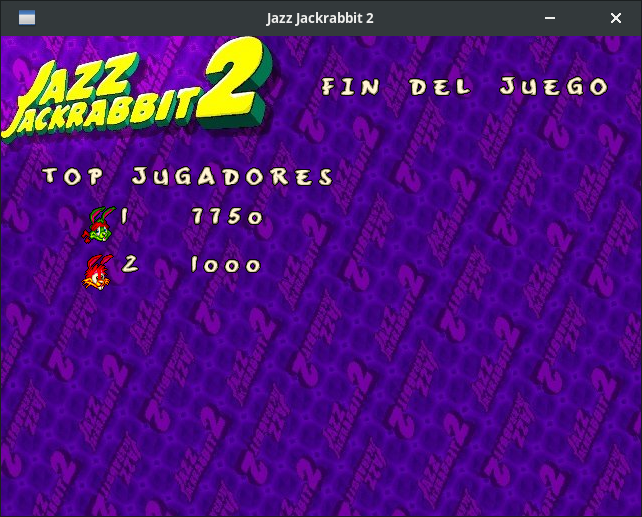

# Manual de usuario

## Introducción
El juego es un remake multijugador del Jazz Jackrabbit 2, un shooter de plataformas de los años 90 producido
por Epic MegaGames.

El juego consiste en partidas de corta duración de dos o más jugadores. El objetivo es obtener la mayor cantidad de
puntos posible, ya sea recolectando gemas, monedas, eliminando enemigos u otros jugadores.

## Requisitos

El juego fue desarrollado para ejecutarse en el sistema operativo Ubuntu 22.04 LTS. Sin embargo, funciona también en
otras distribuciones de Linux basadas en Ubuntu o Debian.

Para la instalación, es necesario tener instalado [git](https://git-scm.com/).

## Instalación

El primer paso es clonar el repositorio. En una terminal, ejecutar los siguientes comandos:

```bash
git clone https://github.com/AgustinAltamirano/Jazz-Jackrabbit.git
git submodule update --init --recursive
```

Una vez realizado esto, se debe ejecutar el siguiente comando, con el cual se instalará y compilará todo el proyecto y
sus dependencias:

```bash
sh install.sh
```

## Ejecución

Para poder jugar, se necesita primero iniciar el servidor. Esto se logra ejecutando el siguiente comando desde una
terminal en el directorio `build`:

```bash
./Server <puerto>
```

donde `<puerto>` es el puerto donde se desea abrir el servidor. Ejemplo: `./Server 8080`.

Luego, cada uno de los jugadores que deseen jugar deben ejecutar el siguiente comando desde una terminal en el
directorio `build`:

```bash
./Client <ip> <puerto>
```

donde `<ip>` es la dirección IP del servidor y `<puerto>` es el puerto donde se encuentra el servidor. Ejemplo:
`./Client 127.0.0.1 8080`.

Una vez finalizada la partida, el jugador puede cerrar el cliente desde la interfaz gráfica. Cuando se desee cerrar el
servidor, se debe ingresar la letra `q` en la terminal donde se está ejecutando.

De forma adicional, se cuenta con un editor de mapas, el cual permite crear mapas personalizados para el juego. Para
ejecutar el editor, se debe ejecutar el siguiente comando desde una terminal en el directorio `build`:

```bash
./editor
```

El editor se puede cerrar desde la interfaz gráfica. Más adelante se explica a detalle su uso.

## Comenzar a jugar

Una vez iniciado el servidor, al unirse un nuevo jugador podrá ver la pantalla de inicio:


Haciendo click, se abrirá el menú principal del juego:


Allí, se puede seleccionar si se desea crear una nueva partida (_NEW GAME_) o unirse a una ya existente (_JOIN GAME_).

### Crear una partida

Para crear una partida, se debe seleccionar la opción _NEW GAME_ del menú principal. Aparecerá un mensaje para ingresar
la cantidad de jugadores que se desean en la partida:


La cantidad mínima de jugadores en una partida es 2, mientras que la máxima por defecto es 4 _(este número puede
modificarse si se desea, desde el archivo de configuración `configuracion.yaml`. Más adelante se explica cómo hacerlo)_.

Una vez seleccionada la cantidad, se mostrará la ventana de selección de mapa:


donde los posibles mapas a elegir son:

* **Flashback**: mapa ambientado en un castillo medieval.
* **Jazz in Time**: mapa ambientado en un lugar abierto en la naturaleza
* **Modo editor**: permite seleccionar un mapa personalizado creado con el editor de mapas _(explicado más adelante)_.

Al seleccionar un mapa, se mostrará la ventana de selección de personaje:


donde se puede elegir entre **Jazz**, **Spaz** y **Lori**. Cada uno de ellos cuenta con una habilidad especial única.

Finalmente, se mostrará un pequeño mensaje indicando el código de la partida creada. Este código debe ser compartido con
los demás jugadores que deseen unirse a la partida.


Al hacer click en _OK_, se mostrará la pantalla de espera, que permanecerá hasta que todos los jugadores se hayan unido
a la partida.

### Unirse a una partida

Para unirse a una partida ya creada, se debe seleccionar la opción _JOIN GAME_ del menú principal. Aparecerá un mensaje
para ingresar el código de la partida deseada:


Una vez ingresado el código, se mostrará la ventana de selección de personaje, al igual que en el caso de crear una
partida. Habiendo seleccionado el personaje, se unirá a la partida y se mostrará la pantalla de espera.

## Dentro del juego

### Controles
* `A` - `D`: Moverse a la izquierda/derecha
* `W`: Saltar
* `Espacio`: Disparar
* `Q`: Cambiar al arma anterior
* `E`: Cambiar al arma siguiente
* `G`: Correr muy rápido (dash)
* `H`: Ataque especial
* `TAB`: Mostrar el Top 3 jugadores
* `I`: Truco secreto(*): obtener municiones de todas las armas
* `O`: Truco secreto(*): eliminar a todos los enemigos
* `P`: Truco secreto(*): finalizar la partida
* `ESC`: Salir del juego

El ataque especial de cada personaje es único:

* **Jazz**: Realiza un puñetazo hacia arriba, haciendo daño a todos los enemigos y jugadores que toque.
* **Spaz**: Hace una patada potente hacia un costado, dañando a todo aquel que se interponga en su camino.
* **Lori**: Da una patada voladora que hace mucho daño a todos los enemigos y jugadores que se crucen.

(*) Los trucos secretos están pensados para facilitar la realización de pruebas y no deberían ser utilizados en
partidas normales.

### Vista del juego y HUD

Una vez comenzada la partida, se puede ver la pantalla de juego:


Allí se puede observar la siguiente información:

1. Puntos actuales
2. Vida
3. Número de jugador y su personaje
4. Arma actual y balas restantes
5. Tiempo restante de la partida

Adicionalmente se puede ver el Top 3 jugadores, manteniendo presionada la tecla `TAB`:


### Armas

El jugador cuenta con cuatro armas diferentes:


De izquierda a derecha:

1. **Pistola Infinita**: Arma básica con munición infinita. Realiza poco daño y tiene una buena velocidad de disparo
2. **Revólver Rebotador**: Arma que dispara balas que rebotan en las paredes y enemigos. Tiene una velocidad de disparo
más lenta que la Pistola Infinita, realizando el mismo daño.
3. **Lanzagranadas**: Arma potente que dispara granadas explosivas con caída. Tiene una velocidad de disparo lenta y
realiza mucho daño.
4. **Rifle Certero**: Arma que dispara balas rápidas y precisas. Tiene una velocidad de disparo más lento que el resto de 
las armas, pero es el arma que produce más daño.

Si se desea personalizar las características de cada arma, se puede realizar cambiando los valores en el archivo de
configuración `configuracion.yaml`.

### Objetos

Ya sea explorando el mapa o matando enemigos, el jugador puede recolectar diversos objetos:


* **Monedas**: Otorgan 500 puntos
* **Gemas**: Otorgan 2500 puntos
* **Munición**: Recarga la munición de alguna de las armas (excepto la Pistola Infinita)
* **Zanahoria**: Cura 2 puntos de vida
* **Bebida envenenada**: Quita 1 punto de vida y deja al jugador en un estado envenado, sin poder disparar por unos
segundos.

### Fin de la partida

Al terminar el tiempo de la partida, se finaliza el juego. Se puede ver la pantalla de resultados, donde se muestra el
top de todos los jugadores de la partida. El ganador es aquel que haya conseguido la mayor cantidad de puntos:




## Configuración

En el directorio raíz del juego se puede encontrar el archivo `configuracion.yaml`, donde se pueden modificar valores
relacionados con las armas, enemigos, objetos, entre otros. Para hacerlo, se debe modificar el valor deseado y luego
volver a abrir el servidor.

## Editor de mapas

El editor de mapas permite crear mapas personalizados para el juego, así como editar los ya existentes. Su interfaz
gráfica es muy intuitiva y fácil de usar:


A la izquierda se encuentran todos los tipos de elementos que se pueden agregar al mapa. De arriba hacia abajo:

* Gemas
* Monedas
* Punto de aparición de enemigos
* Punto de aparición de jugadores
* Bloques de escenario (piso, paredes, diagonales, etc.)